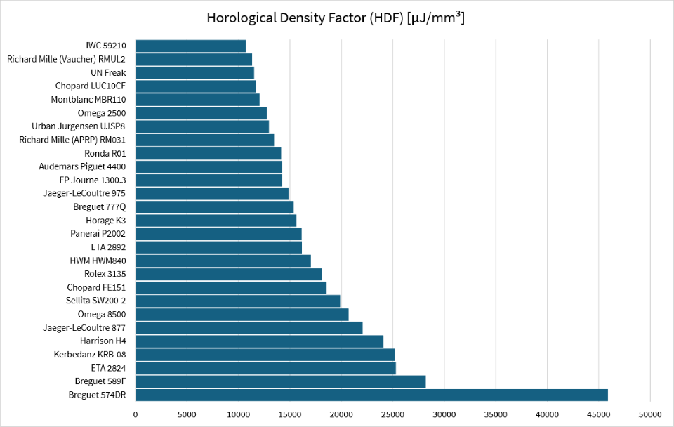
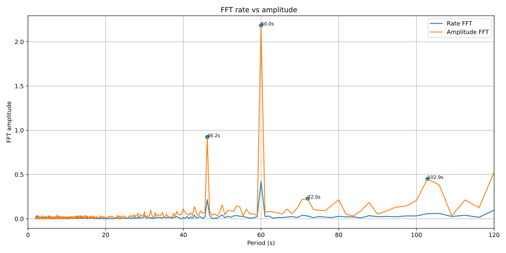
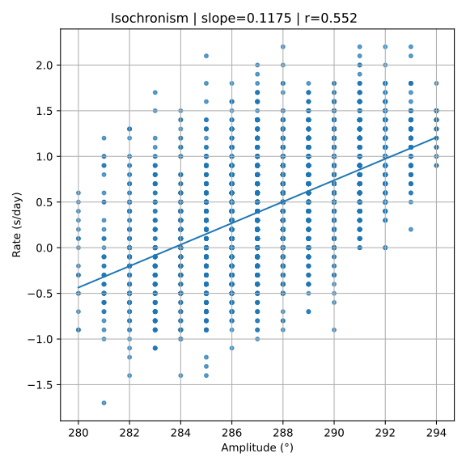
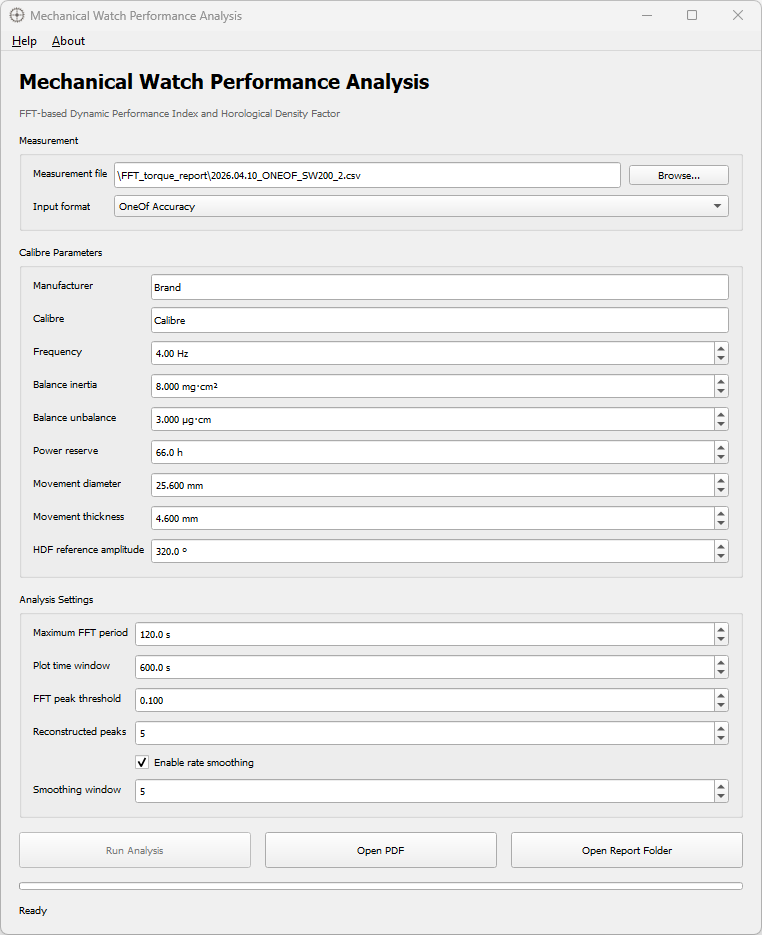
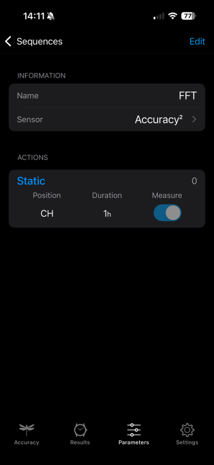
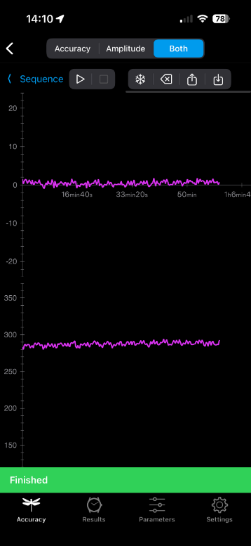
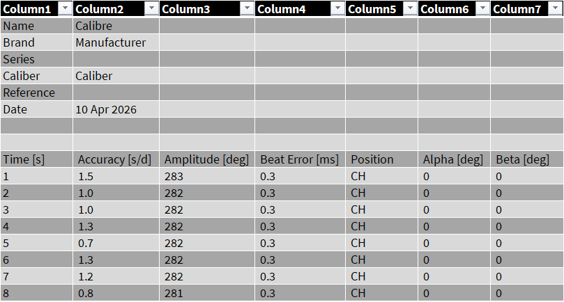

# The First Pillar of Mechanical Watch Performance

## Abstract

Mechanical watches are often judged using a mixture of craftsmanship, aesthetics, chronometric performance and brand reputation. While each of these characteristics contributes to the appreciation of fine watchmaking, they describe fundamentally different aspects of a movement. From an engineering perspective, however, these aspects should not be confused.

A movement may represent an exceptionally efficient mechanical design while requiring extensive regulation before achieving chronometer performance. Conversely, another movement may exhibit outstanding rate stability despite a comparatively modest architectural efficiency.

This article proposes that a complete engineering assessment should therefore distinguish between three complementary performance domains:

- **Construction Efficiency** -- how efficiently the movement has been engineered.
- **Regulation Quality** -- how accurately the finished watch has been adjusted.
- **Dynamic Oscillator Quality** -- how stable the oscillator remains during operation.

Each domain answers a different engineering question, and none should be regarded as a substitute for another. The purpose of this work is not to replace existing methodologies, but to integrate them into a broader engineering framework.

## Introduction

How should the quality of a mechanical watch be evaluated?

For generations this question has been answered from many different perspectives. Collectors often value rarity, finishing and historical significance. Manufacturers emphasise innovation, prestige and craftsmanship. Watchmakers focus on adjustment, reliability and serviceability. Engineers, however, ask a different question. They seek measurable quantities that allow fundamentally different movements to be compared objectively. In most engineering disciplines, performance is never described by a single parameter. An aircraft engine is evaluated by efficiency, reliability, emissions and durability. A racing car is assessed by power, handling and stability. No experienced engineer would attempt to reduce these characteristics to one universal number.

Mechanical watches deserve the same multidimensional approach. Over the past decade, one of the most significant contributions towards an objective engineering assessment has been made by **Tim Lake** through the introduction of the **Horological Density Factor (HDF)**. Rather than focusing on decoration or brand prestige, the HDF evaluates the efficiency with which a movement stores and delivers mechanical energy within a given volume.

This represents an important milestone because it shifts the discussion from subjective opinion towards measurable engineering parameters. The present work fully acknowledges this contribution. However, movement architecture represents only one aspect of mechanical watch performance. Once a watch begins to run, a second engineering discipline comes into play: regulation.

Chronometer certification, most notably through the **Contrôle Officiel Suisse des Chronomètres (COSC)**, evaluates how accurately a completed watch has been adjusted under defined test conditions. This assessment no longer concerns the architecture of the movement but the quality of its regulation.

Finally, modern measurement technology allows a third aspect to be investigated. Using high-resolution timing instruments together with Fast Fourier Transform (FFT) analysis, it is now possible to evaluate the dynamic behaviour of the running oscillator itself. Parameters such as frequency stability, spectral purity, harmonic content and transient disturbances reveal characteristics that remain invisible in conventional rate measurements. These three approaches evaluate different physical properties. They are not competing methods. They are complementary engineering tools.

Throughout this article they will therefore be referred to as:

**Construction Efficiency**

evaluated by the Horological Density Factor (HDF),

**Regulation Quality**

evaluated by chronometric standards such as COSC, and

**Dynamic Oscillator Quality**

evaluated through the proposed Dynamic Performance Index (DPI). Together, these three perspectives provide a more comprehensive engineering assessment than any single metric alone.

## Construction Efficiency

Before a mechanical watch ever ticks for the first time, many of its fundamental characteristics have already been determined. The designer chooses the movement diameter, thickness, barrel dimensions, gear train configuration, balance inertia, oscillation frequency and the available volume for energy storage.

These decisions define the movement's mechanical potential. They determine how efficiently mechanical energy can be stored, transmitted and delivered to the oscillator. This is precisely the engineering question addressed by Tim Lake's Horological Density Factor. Unlike traditional specifications such as power reserve or movement thickness, the HDF combines several physical parameters into a single engineering metric describing the efficiency of the overall movement architecture. It therefore measures **construction efficiency**. It does **not** measure chronometric performance. That distinction is fundamental.

# Horological Density Factor (HDF)

One of the greatest challenges in comparing mechanical watch movements is that they differ fundamentally in size, architecture and intended application. Comparing individual specifications such as power reserve, movement thickness or oscillation frequency rarely provides a meaningful assessment of engineering quality.

A larger movement naturally accommodates a larger mainspring barrel and therefore stores more energy. Conversely, an ultra-thin calibre may sacrifice energy storage in favour of reduced thickness, while a higher oscillation frequency improves theoretical time resolution at the expense of increased energy consumption.

These parameters cannot be evaluated independently. To address this problem, Tim Lake introduced the **Horological Density Factor (HDF)**, an engineering metric that combines balance power, running time and movement volume into a single quantitative index. Rather than asking *how much* energy a movement stores, the HDF addresses a more fundamental engineering question:

**How efficiently is mechanical energy packaged within the available movement volume?** This makes the HDF a measure of **construction efficiency**, rather than chronometric performance.

The first step is to estimate the power required to maintain the oscillation of the balance wheel.

$$
P_{balance} = \frac{1}{2}I\theta^{2}(2\pi f)^{3}
$$

where

- I is the balance inertia,
- θ is the balance amplitude in radians,
- f is the oscillation frequency in hertz.

For practical watchmaking calculations it is convenient to use engineering units.

$$
P_{balance}\lbrack\mu W\rbrack = \frac{\frac{1}{2}I_{mg\, cm^{2}}\left( \theta\frac{\pi}{180} \right)^{2}(2\pi f)^{3}}{10000}
$$

where

- the balance inertia is expressed in **mg·cm²**,
- the amplitude in **degrees**,
- the oscillation frequency in **Hz**.

The movement volume is approximated as a cylindrical body.

$$
V_{calibre} = \frac{\pi}{4}D^{2}t
$$

where

- D is the movement diameter,
- t is the movement thickness.

Although simplified, this approximation provides an excellent basis for comparing movements of different sizes.

The Horological Density Factor is then defined as

$$
{HDF} = 3600\,\frac{P_{{balance}}T_{{reserve}}}{V_{{calibre}}}
$$

where

- Pbalance is the balance power in **µW**,
- Treserve is the power reserve in **hours**,
- Vcalibre is the calibre volume in **mm³**.

The resulting unit,

$$
\mu J/{mm}^{3}
$$

represents the usable balance energy stored per unit movement volume. Unlike traditional specifications, the HDF combines several independent engineering parameters into a single objective measure of construction efficiency.

**Example Calculation**

To illustrate the calculation, consider a modern automatic wristwatch movement with the following characteristics.

| Parameter       | Value             |
|:--------------- | -----------------:|
| Balance inertia | 8.0 mg·cm²        |
| Frequency       | 4 Hz (28,800 A/h) |
| Balance power   | 198 µW            |
| Power reserve   | 66 h              |
| Diameter        | 25.6 mm           |
| Thickness       | 4.6 mm            |

The calibre volume becomes

$$
V_{calibre} = \frac{\pi}{4}(25.6)^{2} \cdot 4.6 = 2366 mm^{3}
$$

Finally,

$$
HDF = 3600\,\frac{198 \cdot 66}{2366} = 19869 J/mm^{3}
$$

This result indicates that the movement stores approximately **19,869 µJ of usable balance energy per cubic millimetre of movement volume**, providing an objective measure of how efficiently the available space has been utilised.

The Horological Density Factor therefore rewards movements that simultaneously deliver high balance power, maintain long running times and achieve both within a compact movement.

It is important, however, to recognise the intended scope of the HDF. The index evaluates **how efficiently a movement has been engineered**. It does not evaluate how accurately the finished watch has been regulated, nor how stable the oscillator remains during operation.

These questions belong to two additional engineering domains discussed in the following sections:

- **Regulation Quality**, assessed by chronometric standards such as COSC.
- **Dynamic Oscillator Quality**, assessed through frequency-domain analysis and the proposed Dynamic Performance Index (DPI).

Taken together, these three complementary metrics provide a significantly more complete engineering assessment of a mechanical watch than any single parameter alone.

# Regulation Quality

While the Horological Density Factor evaluates the engineering efficiency of a movement, it does not indicate how accurately the completed watch keeps time. This is the purpose of chronometric regulation. Once a movement has been assembled, lubricated and adjusted, its rate can be optimised by carefully regulating the balance spring, adjusting the active hairspring length and correcting the beat error. The objective is to minimise the daily rate deviation under defined operating conditions.

The most widely recognised international standard for this purpose is the **Contrôle Officiel Suisse des Chronomètres (COSC)**. Unlike the HDF, which evaluates the movement itself, the COSC evaluates the performance of the completed watch after regulation. During the certification process, the watch is tested over several days in different positions and at different temperatures. The measured daily rates are then combined into a series of chronometric criteria describing the quality of the regulation.

Rather than relying on a single measurement, the COSC evaluates several complementary characteristics of the running watch, including mean daily rate, positional variation and thermal stability.

One commonly used overall performance indicator is the **Concours Formula**, defined as

$$
CF = 1000 - \left( 50\,|M| + 10\, V + 20\, D + 100\,|P| + 10\,|C| + 10\,|R| \right)
$$

where

- M is the mean daily rate,
- V is the mean variation between positions,
- D is the greatest positional difference,
- P is the variation of the daily rate,
- C is the thermal coefficient,
- R is the rate recovery.

Higher values indicate superior chronometric regulation, with perfect regulation corresponding to a theoretical value of **1000 points**.

## Example

The following examples illustrate the application of the Concours Formula to four modern chronometer movements.

| Mean Rate (s/day) | Variation (s/day) | Max Difference (s/day) | Concours Formula |
| -----------------:| -----------------:| ----------------------:| ----------------:|
| -0.30             | 0.27              | 0.54                   | 919.2            |
| -0.46             | 0.24              | 0.35                   | 848.6            |
| -1.28             | 0.33              | 1.01                   | 845.3            |
| -1.55             | 0.16              | 0.50                   | 843.2            |

These results demonstrate that watches have been regulated to a very high chronometric standard despite small differences in their daily rates and positional behaviour. The COSC therefore provides an objective assessment of **regulation quality**. However, it is important to recognise its scope. The COSC evaluates the timekeeping performance of the watch under defined test conditions. It does not evaluate the engineering efficiency of the movement, nor does it describe the dynamic behaviour of the oscillator itself.

Modern signal processing techniques allow additional characteristics to be investigated. Frequency-domain analysis can reveal oscillator stability, spectral purity, harmonic content and transient disturbances that remain invisible in conventional chronometric measurements.

For this reason, the **Dynamic Performance Index (DPI)** proposed in the following section should not be regarded as an alternative to COSC, but as a complementary engineering tool for evaluating the quality of the running oscillator.

# Dynamic Oscillator Quality (DPI)

The Horological Density Factor evaluates the efficiency of the movement architecture. The COSC evaluates the quality of the regulation. Neither, however, describes how the oscillator behaves during continuous operation. Once a mechanical watch begins to run, the balance wheel becomes a dynamic resonator whose behaviour continuously changes as the mainspring torque decreases throughout the power reserve. At the same time, lubrication, escapement friction, manufacturing tolerances and external disturbances influence the stability of the oscillator.

From an engineering perspective, the question is therefore no longer

*How efficiently was the movement designed?*

or

*How accurately was the watch regulated?*

Instead, the relevant question becomes How stable is the oscillator while the watch is running? The Dynamic Performance Index (DPI) has been developed to answer precisely this question. Unlike the HDF or COSC, the DPI is calculated entirely from measured data obtained from the running watch. It therefore evaluates the behaviour of the oscillator itself rather than the design of the movement or the quality of its adjustment.

## Why introduce a Dynamic Performance Index?

Mechanical watch performance has traditionally been assessed from two complementary perspectives. The first concerns the movement itself. The Horological Density Factor (HDF) evaluates how efficiently the available volume has been converted into useful mechanical performance. The second concerns the finished watch. Chronometric standards such as COSC evaluate how accurately the watch has been regulated under defined operating conditions.

Both approaches are well established and address different engineering questions. However, neither describes the dynamic quality of the oscillator itself. Two watches may exhibit almost identical HDF values and both may satisfy COSC requirements, yet one oscillator may operate with significantly greater dynamic stability than the other. Small periodic disturbances, variations in driving torque, lubrication effects or subtle escapement interactions may remain completely hidden when only the average daily rate is considered.

Modern timing instruments now provide continuous measurements over many minutes or even hours. These data contain substantially more information than can be extracted from conventional rate measurements alone. Using Fast Fourier Transform (FFT) analysis, together with statistical evaluation of the measured rate and amplitude signals, it becomes possible to quantify characteristics that previously remained largely qualitative.

The Dynamic Performance Index (DPI) has therefore been developed as a complementary engineering metric.

Its objective is not to replace existing standards but to quantify the dynamic quality of the running oscillator using objective, reproducible measurements.

Together with HDF and COSC, the DPI completes a three-dimensional engineering assessment of a mechanical watch.

## Selecting the Performance Parameters

The first version of the Dynamic Performance Index intentionally focuses on three measurable engineering parameters that together describe the dynamic quality of the oscillator.

### Short-term Stability

The first parameter describes the short-term stability of the rate.

Instead of evaluating the average daily rate, the complete rate signal is analysed in the frequency domain using a Fast Fourier Transform (FFT). The root-mean-square value of the reconstructed FFT signal, represents the intrinsic short-term instability of the oscillator. A perfectly stable oscillator would have larger values indicate increasing dynamic instability.

### Isochronism Slope

A mechanical oscillator should ideally maintain the same rate regardless of balance amplitude. This relationship can be approximated by a linear regression between balance amplitude and measured daily rate.

The resulting slope

$$
\beta = \frac{dR}{dA}\quad\quad\left\lbrack \frac{s/day}{_{}^{\circ}} \right\rbrack
$$

describes how strongly the rate changes for each degree of amplitude variation. A value close to zero indicates excellent isochronism.

### Realised Isochronism

The isochronism slope alone is insufficient. A watch may exhibit a relatively steep slope while maintaining almost constant amplitude throughout the power reserve. Conversely, a very small slope combined with a large amplitude loss may still result in a considerable rate deviation. The actual influence on chronometric performance is therefore described by

$$
ICI = |\beta|\,\Delta A_{90}
$$

where

- DA90 is the robust 90 % amplitude span,
- ICI is the realised isochronism deviation in seconds per day.

This parameter combines the physical behaviour of the oscillator with the actual operating conditions.

## Dynamic Performance Index

The three parameters are then combined into a single engineering score. Short-term stability contributes 50 % of the total score, while isochronism and realised isochronism each contribute 25 %. The proposed Dynamic Performance Index is therefore

$$
N_{dynamic} = 500\,\max\left( 0,1 - \frac{\sigma_{R,FFT}}{2.0} \right) + 250\,\max\left( 0,1 - \frac{|\beta|}{0.25} \right) + 250\,\max\left( 0,1 - \frac{ICI}{4.0} \right)
$$

with

$$
0 \leq N_{dynamic} \leq 1000
$$

**Why these Limits?**

The normalisation constants

- **2 s/day**
- **0.25 s/day/°**
- **4 s/day**

represent practical engineering limits derived from measurements on modern high-quality mechanical wristwatches. An oscillator that reaches or exceeds these limits receives no points for the corresponding criterion. Conversely, a theoretically perfect oscillator would obtain the maximum score of **1000 points**.

The weighting factors intentionally place the greatest emphasis on dynamic stability, since this parameter describes the intrinsic behaviour of the running oscillator.

**Engineering Interpretation**

The Dynamic Performance Index deliberately ignores the mean daily rate. This is an important distinction. The average rate can always be corrected by regulation. Dynamic instability, however, cannot. The DPI therefore measures **oscillator quality**, rather than regulation quality.

## Example Calculation

The following example illustrates the calculation of the Dynamic Performance Index from a measured rate and amplitude signal.

The analysis yields the following values:

$$
\beta = 0.1175\;\frac{s/day}{_{}^{\circ}}
$$

$$
\Delta A_{90} = 14^{\circ}
$$

The realised isochronism deviation is therefore

$$
ICI = |\beta|\,\Delta A_{90} = 0.1175 \times 14 = 1.645 s/day
$$

and consequently. The FFT-derived rate instability is

$$
\sigma_{R,FFT} = 0.59 s/day
$$

These three values are inserted into the Dynamic Performance Index.

**Rate Stability Score**

The rate stability component contributes a maximum of 500 points.

$$
N_{stability} = 500\left( 1 - \frac{0.59}{2.0} \right) = 352.5
$$

The oscillator therefore receives **352.5 out of 500 points** for short-term rate stability.

**Isochronism Slope Score**

The isochronism slope contributes a maximum of 250 points.

$$
N_{slope} = 250\left( 1 - \frac{0.1175}{0.25} \right) = 132.5
$$

The oscillator therefore receives **132.5 out of 250 points** for its isochronism slope.

**Realised Isochronism Score**

The actual rate deviation caused by the measured amplitude variation contributes a further 250 points.

$$
N_{ICI} = 250\left( 1 - \frac{1.645}{4.0} \right) = 147.2
$$

The oscillator therefore receives **147.2 out of 250 points** for realised isochronism.

**Total Dynamic Performance Index**

The complete Dynamic Performance Index is the sum of the three partial scores.

$$
N_{dynamic} = N_{stability} + N_{slope} + N_{ICI}
$$

Therefore,

$$
N_{dynamic} = 352.5 + 132.5 + 147.2 = 632.2
$$

Rounded to the nearest whole number,

$$
N_{dynamic} = 632
$$

A result of **632 points** indicates that the oscillator exhibits good but not exceptional dynamic performance. The largest contribution comes from short-term rate stability, while the isochronism slope and the realised rate deviation caused by amplitude variation reduce the overall result.

The example also demonstrates why all three components are required. The isochronism slope describes the intrinsic sensitivity of the oscillator to amplitude, whereas the ICI describes how strongly this sensitivity is actually expressed over the measured amplitude range. The FFT-derived stability term independently evaluates periodic and irregular rate fluctuations that cannot be inferred from isochronism alone.

# Conclusion

The quality of a mechanical watch cannot be adequately described by a single engineering parameter. The Horological Density Factor evaluates the efficiency of the movement architecture. Chronometric standards such as COSC evaluate the quality of regulation. The Dynamic Performance Index evaluates the behaviour of the oscillator during continuous operation. Each index therefore answers a different engineering question. Taken together, these three complementary metrics provide a significantly more complete and objective assessment of mechanical watch performance than any individual metric alone.

The methodology presented in this article is fully implemented in the accompanying **Mechanical Watch Performance Analysis** application, available free of charge for both Windows and macOS. The software automatically calculates the Horological Density Factor, the Dynamic Performance Index and generates a comprehensive engineering report from measured timing data.

Rather than replacing existing standards, the proposed methodology extends them by introducing a practical and reproducible framework for evaluating the dynamic behaviour of mechanical watch oscillators. As measurement technology continues to improve, such dynamic analyses may become an increasingly valuable complement to traditional movement design metrics and chronometric certification.

# The Application

To ensure that the proposed methodology is fully reproducible, all calculations described in this article have been implemented in the **Mechanical Watch Performance Analysis** application.

Rather than requiring manual calculations, the software automatically evaluates all three engineering domains introduced in this work:

- **Construction Efficiency** through the Horological Density Factor (HDF),
- **Regulation Quality** through the COSC Concours Formula, and
- **Dynamic Oscillator Quality** through the proposed Dynamic Performance Index (DPI).

The application imports timing data recorded by modern timing instruments, including Witschi TXT files and CSV data generated by ONEOF Accuracy².

After importing a measurement, the user enters the basic movement parameters required for the HDF calculation, including balance inertia, frequency, power reserve and movement dimensions. The software then performs the complete dynamic analysis automatically.

The generated engineering report includes:

- Horological Density Factor (HDF),
- Dynamic Performance Index (DPI),
- FFT spectrum and dominant frequencies,
- rate stability analysis,
- isochronism analysis,
- realised isochronism (ICI),
- statistical evaluation of the measurement,
- and a complete PDF report containing all calculated parameters and diagrams.

The application has been developed in Python and is available free of charge for both **Windows** and **macOS**. Its primary objective is to make the methodology presented in this article transparent, reproducible and easily accessible to watchmakers, manufacturers, researchers and collectors. By providing both the mathematical framework and an openly available implementation, the proposed methodology can be independently verified and applied to virtually any mechanical watch.

## ONEOF Accuracy²

ONEOF Accuracy² is ideal for comprehensive FFT analysis. In this chapter, I will show you how to use ONEOF and how the CSV import needs to be modified in Python.

### ONEOF sequences

First, we create a sequence with a measurement duration of 1 hour and a position. In this case, I am using CH = top of the dial.

ONEOF records the average value every second. With standard Witschi devices, the measurement is averaged every 2 seconds.

Once the measurement is complete, we export a CSV file. This file differs from the Witschi measurement.

...

For this reason, we need to adjust the import.

### CSV import for ONEOF Accuracy² and Witschi TXT

With this CSV file, we can read the calibre name and brand from the header of the file.

The following script reads manual CSV files with 3 columns or CSV files from Accuracy by H2i, as well as TXT files from Witschi. The load_measurement() function allows you to easily select between the different formats. In the main script, you simply need to import this function. The sample CSV and TXT files for the script can also be downloaded from my server. They are included in the script package.

Final Remarks
-------------

The methodology presented in this article is intended as an invitation rather than a conclusion. The proposed framework does not seek to replace existing evaluation methods, but to complement them by separating three fundamentally different engineering questions: construction efficiency, regulation quality and dynamic oscillator quality.

The accompanying **Mechanical Watch Performance Analysis** application has therefore been released free of charge for both Windows and macOS. Readers are encouraged to analyse their own measurements, compare different movements and evaluate the proposed indices using their own data. Constructive discussion and independent validation are essential steps towards establishing objective engineering methods within modern watchmaking.

For readers wishing to explore the mathematical and computational background in greater depth, the book **_Watchmaking with Python_** provides a comprehensive introduction to the algorithms and numerical techniques used throughout this work. In addition to the Dynamic Performance Index presented here, the book covers signal processing, Fast Fourier Transform (FFT) analysis, numerical methods and many other engineering applications for mechanical watch development.

Ultimately, no single number can fully describe the quality of a mechanical watch. However, by combining **Construction Efficiency (HDF)**, **Regulation Quality (COSC)** and **Dynamic Oscillator Quality (DPI)**, it becomes possible to evaluate mechanical performance from three complementary engineering perspectives. Whether the proposed Dynamic Performance Index will eventually become an established engineering metric remains to be seen. Its future will ultimately depend on practical application, independent validation and constructive discussion within the watchmaking community.

# References

Lake, T. (2021). *Horological Density Factor (HDF).* Independent publication.

Contrôle Officiel Suisse des Chronomètres (COSC). *Testing Standards for Swiss Chronometers.*

Eisenegger, K. (2026). *Watchmaking with Python.* Watchmaking.com.

Cooley, J. W., & Tukey, J. W. (1965). *An Algorithm for the Machine Calculation of Complex Fourier Series.* Mathematics of Computation, 19(90), 297--301.

Oppenheim, A. V., & Schafer, R. W. (2010). *Discrete-Time Signal Processing.* 3rd Edition. Pearson.

Press, W. H., Teukolsky, S. A., Vetterling, W. T., & Flannery, B. P. (2007). *Numerical Recipes: The Art of Scientific Computing.* Cambridge University Press.

